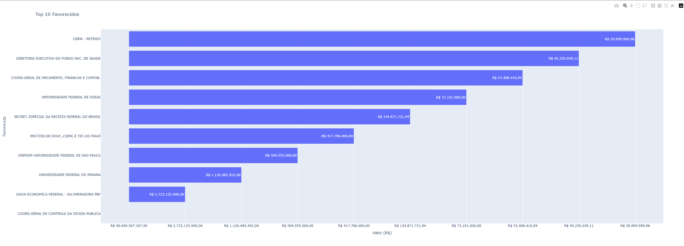
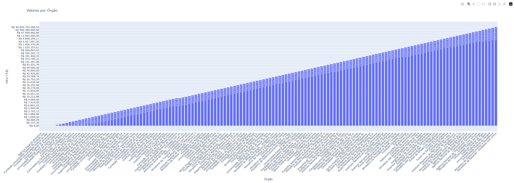
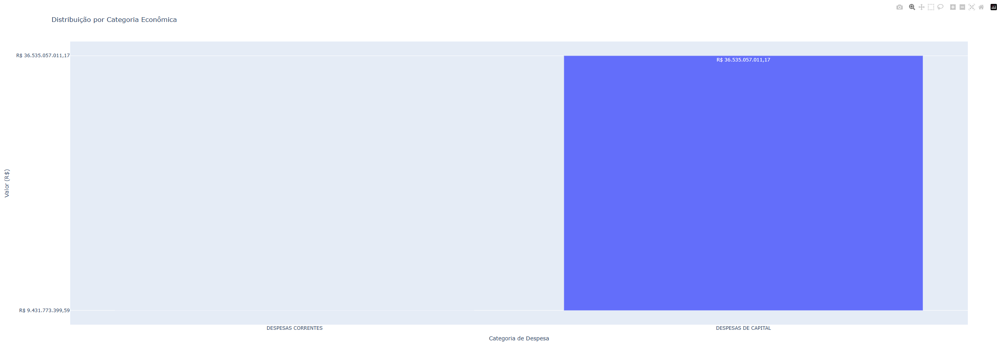
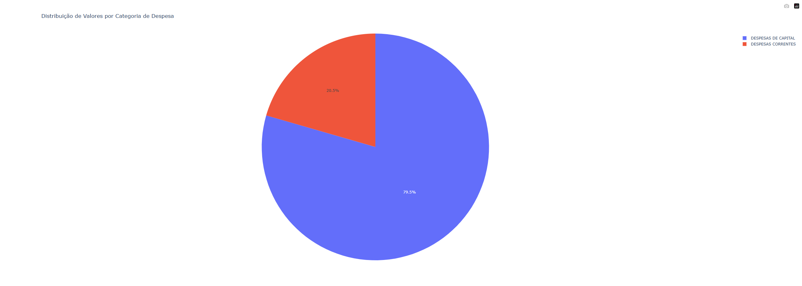

# A3 Big Data
Este projeto utiliza Python, Pandas e Plotly para análise e visualização de dados de despesas públicas a partir de um arquivo CSV do site Portal da Transparência: 
Link: https://portaldatransparencia.gov.br/download-de-dados/despesas

## Pré-requisitos

Certifique-se de ter o Python 3 e o `pip` instalados em seu sistema.

## Instalação

1. Clone este repositório:
```git clone https://github.com/anthonyzutter/a3-big-data.git```
```cd a3-big-data```

2. Instale as dependências:
```pip install -r requirements.txt```


3. Execução
```python index.py```

## Gráficos
### 1. Top 10 favorecidos
Exibe os 10 maiores beneficiários de recursos públicos.



### 2. Valores por Órgão
Apresenta a distribuição de valores por órgão público.



### 3. Distribuição por Categoria
Mostra os valores das despesas correntes e as despesas de capital



### 4. Distribuição de valores por Categoria (gráfico de pizza)
Mostra os valores das despesas correntes e as despesas de capital

